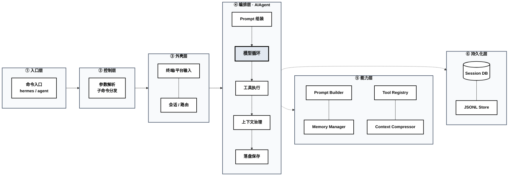

# Hermes 架构解析 (一)：流程篇 · 源代码执行全生命周期 (v2026.4.8)

本篇深度分析旨在系统性地解构 Hermes Agent 的核心架构与运行机制，重点探讨以下五个核心命题：

1. **入口逻辑**：请求是如何从外部触发并精准送达内核的？
2. **Turn 级初始化**：为何 `AIAgent` 选择按轮次（Turn）进行动态初始化？
3. **执行全生命周期**：`run_conversation()` 在运行过程中经历了哪些关键阶段？
4. **能力解耦**：上下文压缩、工具执行、持久化及后台复盘逻辑是如何分布的？
5. **设计权衡**：这套架构解决了哪些工程痛点，又在复杂性上做出了哪些妥协？

---

## 1. 阅读指引与核心范围

分析工作主要围绕以下核心模块展开：

| 模块 | 关键文件 | 核心关注点 |
| --- | --- | --- |
| **入口与外壳** | `hermes`、`hermes_cli/main.py`、`cli.py`、`gateway/run.py` | 请求接入路径、统一会话模型的抽象与落地。 |
| **编排内核** | `run_agent.py` | Turn 主循环、工具执行流、上下文治理、状态持久化。 |
| **辅助能力层** | `agent/prompt_builder.py`、`agent/memory_manager.py`、`agent/context_compressor.py`、`agent/smart_model_routing.py` | Prompt 组装策略、记忆召回、上下文压缩、动态路由逻辑。 |
| **工具运行时** | `model_tools.py`、`tools/registry.py`、`tools/skills_tool.py`、`tools/skill_manager_tool.py` | 工具分发机制、技能生命周期管理、技能沉淀过程。 |
| **持久化层** | `hermes_state.py`、`gateway/session.py` | SQLite 存储方案、Session 日志、网关会话副本管理。 |

### 核心代码走读顺序建议：

| 步骤 | 目标文件 | 关键方法 / 入口 | 逻辑要点 |
| --- | --- | --- | --- |
| `1` | `hermes` | launcher | 命令行指令如何转发至 Python 入口。 |
| `2` | `hermes_cli/main.py` | `main()` | 参数解析、子命令分发，默认进入 `chat` 模式。 |
| `3` | `hermes_cli/main.py` | `cmd_chat()` | 完成基础配置与技能同步后，移交控制权给 `cli.main()`。 |
| `4` | `cli.py` | `HermesCLI.__init__()` 等 | Turn 路由决策与延迟初始化逻辑。 |
| `5` | `run_agent.py` | `AIAgent.__init__()` | Provider、工具集、记忆组件与压缩器的装配。 |
| `6` | `run_agent.py` | `run_conversation()` | 单次 Turn 执行的真实入口。 |
| `7` | `run_agent.py` 等 | `_build_system_prompt()` 等 | 稳定上下文（System Prompt）的构建策略。 |
| `8` | `run_agent.py` 等 | `_compress_context()` 等 | Preflight 压缩机制与会话血缘（Lineage）维护。 |
| `9` | `run_agent.py` 等 | `prefetch_all()` 等 | 易变内容（Memory）的瞬时注入。 |
| `10` | `run_agent.py` | `_execute_tool_calls()` | 工具执行的批次处理（并发或串行）。 |
| `11` | `model_tools.py` 等 | `handle_function_call()` 等 | 工具调用如何回落至全局注册表分发。 |
| `12` | `run_agent.py` 等 | `_persist_session()` 等 | 状态持久化、预热机制及异步后台复盘。 |

对于关注 **Gateway（网关）** 路径的读者，请将上述第 `2-4` 步替换为：

| 步骤 | 目标文件 | 关键方法 / 入口 | 逻辑要点 |
| --- | --- | --- | --- |
| `2G` | `gateway/run.py` | `start_gateway()` | 网关启动、技能同步及 Runner 生命周期管理。 |
| `3G` | `gateway/run.py` | `GatewayRunner.__init__()` | 平台适配器、Session 存储、Agent 缓存机制。 |
| `4G` | `gateway/run.py` | `_resolve_turn_agent_config()` | Gateway 复用 Turn 级路由逻辑。 |

---

## 2. 架构全景：从外壳到内核的六层演进

理解 Hermes 的关键在于把握其纵向分层的设计哲学。



### 层级职责详述：

| 层级 | 核心模块 | 职责定义 |
| --- | --- | --- |
| **入口层** | `pyproject.toml`、`hermes` | 暴露 CLI 指令，确定系统的运行表面。 |
| **控制层** | `hermes_cli/main.py` | 环境预检、配置加载、多级子命令路由。 |
| **外壳层** | `cli.py`、`gateway/run.py` | 差异化接入（终端/网关），封装为统一的 Session 模型。 |
| **编排层** | `run_agent.py:AIAgent` | **系统心脏**：驱动 Prompt 组装、模型循环及上下文治理。 |
| **能力层** | `agent/*`、`tools/*` | 记忆（Memory）、技能（Skill）、压缩（Compression）等原子能力。 |
| **持久化层** | `hermes_state.py`、`gateway/session.py` | SQLite 关系存储与 JSONL 增量日志的双重持久化。 |

**分层的工程价值：**
- **解耦接入与逻辑**：`AIAgent` 屏蔽了消息来源，无论是 CLI 还是 Gateway。
- **原子化能力演进**：记忆治理、上下文压缩等模块可独立迭代，互不干扰。
- **一致性保证**：Gateway 并非另一套内核，而是共享编排逻辑的另一种接入形式。

---

## 3. 动态内核：为什么 `AIAgent` 按 Turn 初始化

在 `v2026.4.8` 中，`AIAgent` 的生命周期并非与进程绑定，而是与 **Turn（对话轮次）** 强关联。

### CLI 调用链分析：
```
hermes -> hermes_cli.main:main() 
  -> cmd_chat() 
    -> cli.main() 
      -> HermesCLI.__init__() 
        -> 轮次预检：_resolve_turn_agent_config()
        -> 内核重建：_init_agent()
          -> AIAgent(...)
```

**设计意图：Turn 级智能路由**
1. **实时洞察**：外壳层先捕获当前输入，由 `smart_model_routing.py` 计算路由指纹（Route Signature）。
2. **按需重建**：若路由指纹与当前 Agent 运行时（Runtime）不匹配，则触发 `_init_agent()` 销毁旧内核并重建。
3. **控制权交接**：路由锁定后，真正的控制权才交由 `AIAgent.run_conversation()`。

**这种设计的收益与代价：**
- **收益**：实现了极致的资源优化。简单任务走轻量模型，复杂逻辑动态切换至重型模型，避免资源长期闲置。
- **代价**：增加了状态管理的复杂性，需处理内核重建时的历史继承、缓存复用及断点恢复。

---

## 4. 单次 Turn 的时序解析

我们将 `run_conversation()` 视为系统主线，一次完整的 Turn 可拆解为 **四个阶段、六个步骤**。

```mermaid
flowchart LR
    classDef stage fill:#f8fafc,stroke:#475569,stroke-width:2px,color:#000000,font-weight:900,font-size:16px;
    classDef nodeStyle fill:#ffffff,stroke:#000000,stroke-width:2px,color:#000000,font-weight:900,font-size:14px,font-family:sans-serif;
    classDef loopStyle fill:#e2e8f0,stroke:#000000,stroke-width:3px,color:#000000,font-weight:900,font-size:15px;
    classDef toolStyle fill:#ffffff,stroke:#000000,stroke-width:2px,color:#000000,font-weight:900,font-size:14px;
    classDef storageStyle fill:#ffffff,stroke:#000000,stroke-width:2px,stroke-dasharray: 4 2,color:#000000,font-weight:900,font-size:14px;

    %% 阶段1: 路由与初始化 (强制纵向)
    subgraph S1 [" 阶段 I: 路由与初始化 "]
        direction TB
        A["A 用户输入<br/>(CLI / Gateway)"] --> B["B Turn 路由<br/>(resolve_turn_route)"]
        B --> C["C 重建 Agent<br/>(_init_agent)"]
    end

    %% 阶段2: 上下文准备
    subgraph S2 [" 阶段 II: 上下文准备 "]
        direction TB
        D["D 恢复 Runtime<br/>(复制历史/回填)"] --> E["E System Prompt 冻结<br/>(_cached_system_prompt)"]
        E --> F["F Preflight 压缩<br/>(_compress_context)"]
        F --> G["G 易变内容注入准备<br/>(Memory / Plugin / Prefill)"]
    end

    %% 阶段3: 核心推理循环
    subgraph S3 [" 阶段 III: 核心推理循环 "]
        direction TB
        H["H 组装 Payload<br/>(System+User 注入)"] --> I{"I 主循环<br/>(tool_calls?)"}

        subgraph ToolSet [" 工具分发执行 "]
            direction TB
            J["J Agent 特判<br/>(todo / memory / delegate)"]
            K["K 普通工具回落<br/>(Registry Dispatch)"]
        end

        I -- "是" --> ToolSet
        ToolSet --> L["L 结果回写 & 压缩<br/>(Message Sync)"]
        L --> H
    end

    %% 阶段4: 输出与复盘
    subgraph S4 [" 阶段 IV: 输出与复盘 "]
        direction TB
        M["M 生成最终响应"] --> N[("N 持久化<br/>(DB / Log / Trans)")]
        N --> O["O 主响应返回用户"]
        O -.-> P["P Post-turn 异步处理<br/>(Memory Sync / Prefetch)"]
    end

    %% 跨阶段连接
    C --> D
    G --> H
    I -- "否" --> S4

    %% 样式应用
    class S1,S2,S3,S4 stage;
    class A,B,C,D,E,F,G,H,L,M,O nodeStyle;
    class I loopStyle;
    class J,K toolStyle;
    class N,P storageStyle;
```



### 4.1 路由预处理 (A → B → C)
真正的编排开始前，外壳层必须确定当前轮次的路由配置：
- CLI 与 Gateway 分别通过各自的入口捕获输入。
- 共同调用 `resolve_turn_route()` 计算本轮路由指纹。
- 若指纹变更，立即执行 `_init_agent()` 重建 Runtime。

### 4.2 Runtime 状态恢复 (D)
进入 `run_conversation()` 后，系统首先执行 `_restore_primary_runtime()`，确保：
- Fallback Provider 状态归位，计数器清零，Iteration Budget（迭代预算）恢复。
- 深度复制会话历史，剥离非必要噪音信息。
- 必要时通过 `_hydrate_todo_store()` 恢复待办任务状态。

### 4.3 上下文治理：冻结与预压缩 (E → F)
在调用模型前，系统进行高强度的上下文治理：
1. **System Prompt 冻结**：检查缓存并决定是否调用 `_build_system_prompt()` 重新构建（包含身份、技能索引、上下文文件等）。
2. **Preflight 压缩**：在主循环开始前，粗估 Token 规模。若逼近阈值，立即触发 `ContextCompressor.compress()` 执行结构化压缩。

### 4.4 稳定与易变内容的差异化注入 (G → H)
Hermes 严格区分了两类上下文信息：
- **稳定内容**（如系统约束、技能索引）：注入 Cached System Prompt，追求最大化的 Prompt Cache 复用。
- **易变内容**（如 Memory Recall、插件 Hook 结果、临时 Prompt）：仅注入当前 API Payload，不直接写回长期历史，避免污染 Transcript。

### 4.5 模型驱动的工具回路 (H → I → J → K → L)
主循环的核心并非单次 API 调用，而是“模型回复驱动的工具循环”：
- **响应级治理**：流式处理、重试策略及 Token 使用情况统计。
- **工具调用清洗**：修正模型幻觉、JSON 校验及批量调用限制。
- **双轨执行路径**：
    - **内核特判工具**：如 `todo`、`delegate_task`，由内核直接拦截处理。
    - **普通注册工具**：回落至注册表，由 `ToolRegistry.dispatch()` 映射至具体处理器。

    **收敛条件**：循环直至无 `tool_calls` 产生，或触发迭代预算耗尽（此时会强制生成一次总结）。

### 4.6 异步后处理与复盘 (M → N → O → P)
当最终响应构建完成（M）并落盘持久化（N）后，主响应即返回用户（O）。然而，Turn 级生命周期并未就此结束：
- **Memory 同步**：执行 `MemoryManager.sync_all()` 更新长期记忆。
- **预热机制**：为下一轮 Recall 执行 Prefetch。
- **后台复盘**：满足条件时，唤醒异步任务进行 `background_review`，实现系统的自我完善。

---

## 5. 总结

Hermes Agent v2026.4.8 的源代码揭示了一个高度模块化且具备强大韧性的 Agent 系统。通过将 **Turn 级路由** 提升至架构的第一优先级，它成功解决了长对话场景下的资源效率与模型匹配问题；而 **Preflight 压缩** 与 **差异化上下文注入** 的引入，则展示了其在 Token 预算治理上的前瞻性。

这种设计虽然在 Runtime 状态管理上引入了更高的实现门槛，但其带来的收益是显著的：它不再是一个简单的 Prompt 包装器，而是一个具备完整生命周期感知、状态持久化保障及自我演化能力的 Agent 操作系统。对于开发者而言，理解这套“外壳-编排-能力”的六层模型，是掌握 Hermes 扩展与调优的关键。
