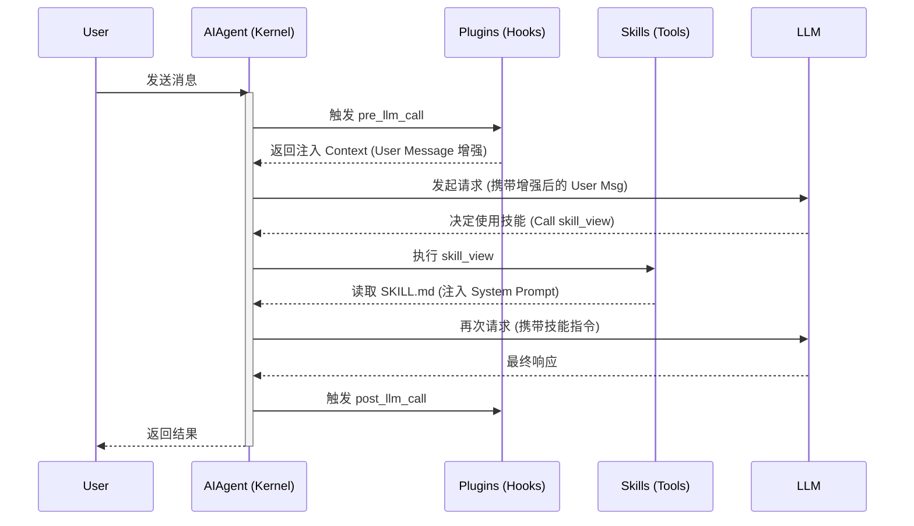

# Hermes 架构解析 (三)：扩展篇 · 插件与技能开发全指南 (v2026.4.8)

本指南旨在通过剖析 Hermes 的内核逻辑（`AIAgent` 运转循环），指导开发者如何编写高性能、低成本的 **技能 (Skills)** 与 **插件 (Plugins)**。

---

## 1. 核心架构：扩展介入点

在 Hermes 的 6 层架构中，扩展机制主要作用于 **Capability Layer (能力层)** 和 **Control Layer (控制层)**。其介入逻辑如下：



---

## 2. 技能 (Skills)：渐进式披露 (Progressive Disclosure)

Hermes 的技能系统遵循 Anthropic 推荐的**渐进式披露架构**，旨在将 Token 消耗控制在最低。

### 2.1 内核运转逻辑
1.  **Tier 1 (Discovery)**：`skills_list` 工具仅向 LLM 暴露技能的 `name` 和 `description`（存放在 `skills_tool.py` 的内存索引中）。此时 LLM 知道“有这个工具”，但不知道“怎么用”。
2.  **Tier 2 (Activation)**：当 LLM 调用 `skill_view(name)` 时，`skills_tool` 会实时读取 `~/.hermes/skills/<name>/SKILL.md`。
3.  **Tier 3 (Injection)**：读取的内容会通过 `AIAgent` 的 `_manage_skills_context` 逻辑，作为“参考资料”插入到当前的 **System Prompt** 中。这样，技能指令只有在真正被需要时才会占用上下文。

### 2.2 开发实践：编写高效的 SKILL.md
```markdown
---
name: code-architect
description: 分析代码依赖并绘制图表 (仅在需要深度重构建议时调用)
metadata:
  hermes:
    requires_tools: [terminal, read_file]
---

# 运转指令
1. 运行 `grep -r "import" .` 建立初步依赖图。
2. 识别循环依赖并标记为 [WARNING]。
3. 必须输出 Mermaid 格式的图表。
```

---

## 3. 插件 (Plugins)：内核钩子与缓存优化

插件是侵入式的，它们直接运行在 `AIAgent` 的 `_run_conversation_loop` 循环中。

### 3.1 核心机制：`pre_llm_call` 的秘密
Hermes 插件系统的一个精妙设计是：**上下文永远注入到 User Message 尾部，而非 System Prompt。**

*   **源码逻辑**（见 `run_agent.py` L7065）：
    ```python
    _pre_results = _invoke_hook("pre_llm_call", ...)
    # 插件返回的 context 被拼接到 original_user_message
    _plugin_user_context = "\n\n".join([r["context"] for r in _pre_results])
    ```
*   **为什么这么做？**
    1.  **Prompt Cache 命中**：System Prompt 在 Hermes 中包含模型指令、工具定义和已加载技能，体积庞大且相对静态。
    2.  **避免失效**：如果插件修改了 System Prompt，每一轮对话都会导致缓存失效，Token 成本飙升。
    3.  **时效性**：将 RAG 知识或系统状态（如 CPU 负载）作为“用户当前感知的环境”喂给 LLM，逻辑上更符合 Tool-use 规范。

### 3.2 实践：开发一个系统监控插件
**`~/.hermes/plugins/sys_monitor/__init__.py`**:
```python
def _on_pre_llm_call(**kwargs):
    # 这一行返回的内容会直接被 AIAgent 塞进当前 turn 的用户消息里
    cpu = get_cpu_load() 
    return {"context": f"[系统实时状态: CPU负载 {cpu}%]"}

def register(ctx):
    ctx.register_hook("pre_llm_call", _on_pre_llm_call)
```

---

## 4. 扩展能力的“权重”与冲突

当多个扩展同时工作时，Hermes 遵循以下优先级：
1.  **System Prompt (最高)**：由 `AIAgent` 内核定义，包含固定的工具调用规则。
2.  **Skill Context (次之)**：由 `skill_view` 动态注入，作为 System Prompt 的补充。
3.  **Plugin Context (灵活)**：注入在 User Message 中，作为 LLM 理解当前环境的“临时感知”。

### 冲突处理原则
*   如果插件修改了全局变量（如 `self.model`），它将影响后续整个生命周期的决策。
*   如果多个插件同时注册了 `pre_llm_call`，Hermes 会按目录名排序依次执行，并用 `\n\n` 拼接所有返回的 `context`。

---

## 5. 调试建议

要观察机制是否按预期运转，可以使用以下命令：
*   **查看插件加载状态**：`hermes status`。
*   **查看当前 Session 的工具集**：`/tools` (在交互式 Shell 中)。
*   **跟踪 Hook 注入**：启动时设置 `export HERMES_LOG_LEVEL=DEBUG`，观察 `AIAgent` 日志中 `pre_llm_call results` 的输出。
