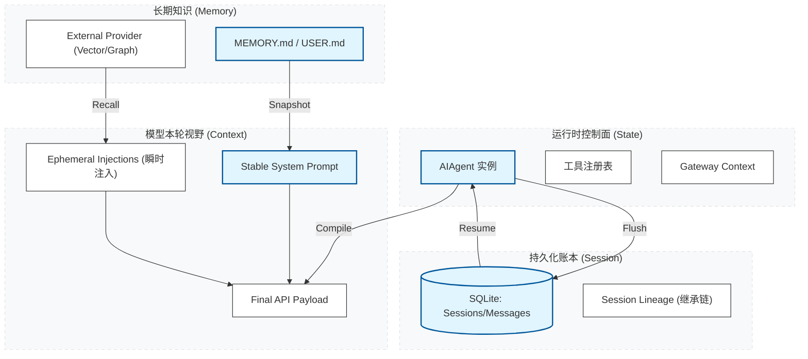
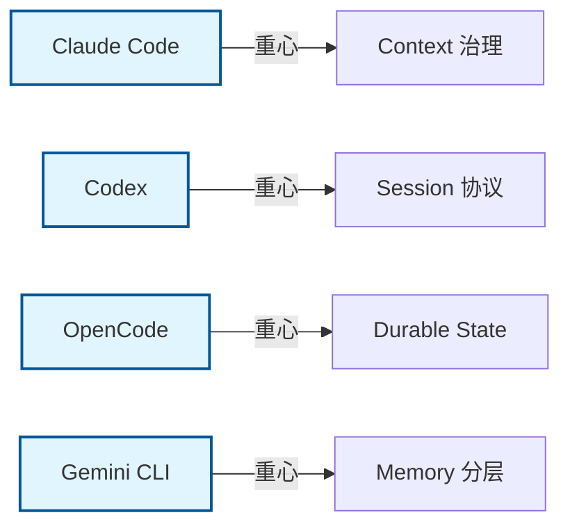
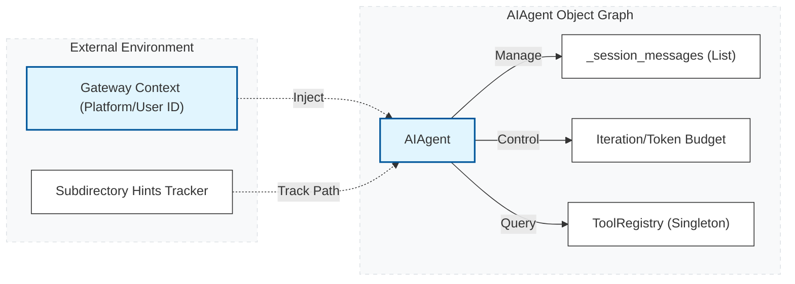
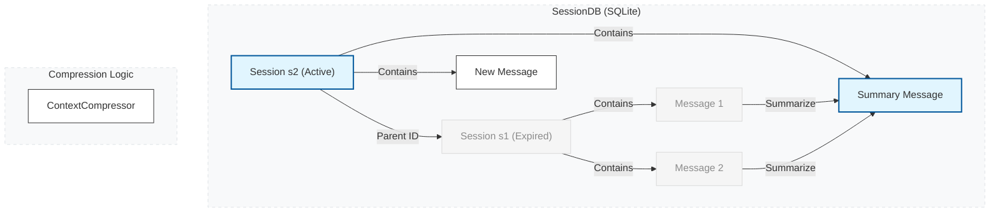
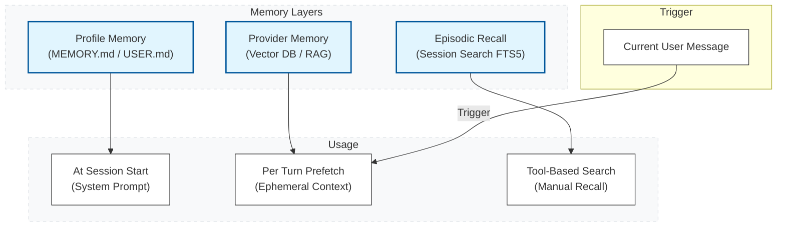
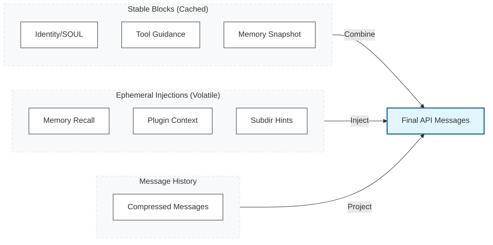
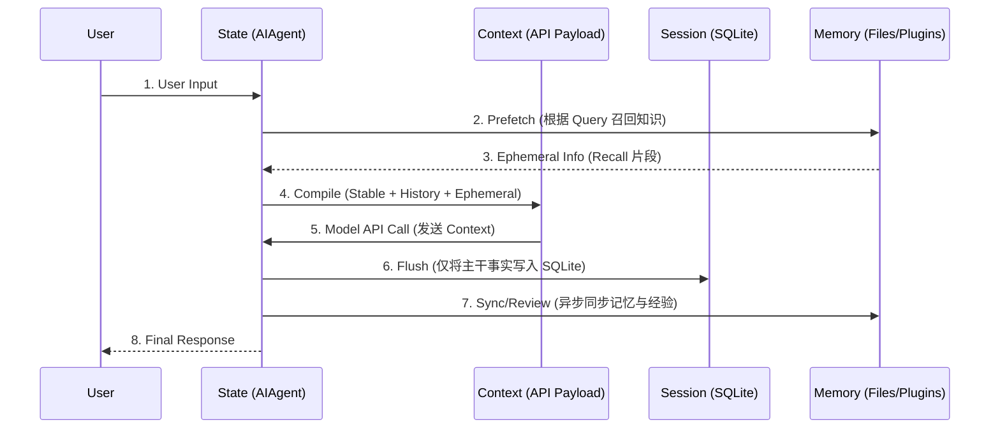
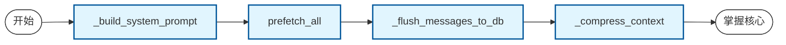

# Hermes 架构解析 (二)：数据篇 · 状态模型与上下文治理 (v2026.4.8)

在 Hermes 的工程实现中，**State (状态)**、**Session (会话)**、**Memory (记忆)** 与 **Context (上下文)** 是四个核心概念。它们既紧密相关，又有极其严格的工程边界。

本文旨在回答：这四个词在工程上分别是什么？在 Hermes 与主流 Agent 系统中如何流转？

---

## 1. 核心语义图谱：从持久化到瞬时编译

Hermes 的数据治理是一个典型的“从持久化到瞬时编译”的过程。

### 概念边界定义

| 概念 | 它回答的问题 | 是否持久化 | 核心载体 |
| :--- | :--- | :--- | :--- |
| **State** | 系统现在正在发生什么 | 通常以内存为主 | `AIAgent` 实例、`ToolRegistry` |
| **Session** | 哪一段连续交互算同一个会话 | **是**，通常可恢复 | `SessionDB` (SQLite) |
| **Memory** | 哪些事实值得跨会话保留 | **是**，但通常是精选 | `MEMORY.md`, `MemoryManager` |
| **Context** | 这一轮模型真正看到了什么 | 不一定，通常是编译结果 | `api_messages` (最终负载) |

---

## 2. 业界参考：四大系统的统一认识

在深入 Hermes 之前，我们先看业界 4 个标杆系统如何处理这四者关系。这是理解 Hermes 设计取舍的前提。

### 2.1 Claude Code：`State` 极强，`Context` 治理极致
- **State**：类似前端的全局状态树，决定了工具循环、权限、UI。
- **Context**：通过 `context collapse/compaction` 决定哪些历史能进入模型视野。
- **Memory**：独立于 State/Session 之外的长期知识层。

### 2.2 Codex：`Session` 模型最“协议化”
- **Session**：定义了 `Thread/Turn/ThreadItem`。它把“会话”当成第一公民。
- **State**：分布在 `ThreadManagerState` 等运行时对象中。
- **Context**：将线程历史、`AGENTS.md`、工具表面重新编译后发送给模型。

### 2.3 OpenCode：先写 Durable State，再编译 Context
- **Session**：是 `SQLite-first` 的持久账本。
- **State**：是执行态和事件态，不一定全部入库。
- **Context**：并非简单复制数据库消息，而是一次经过 summary/diff 的编译。

### 2.4 Gemini CLI：`Memory` 分层最明显
- **Memory**：分层组织（Global, Extension, Project）。
- **Context**：是“系统级 + 会话级 + 按需发现（JIT）”的编译结果。
- **State**：体现在 `UIState`、`Scheduler` 等运行时组件中。

---

## 3. Hermes 的 State：运行时的“对象图”

Hermes 的 **State** 是驱动系统运转的实时控制面。

1.  **AIAgent 运行时**：分散在 `AIAgent`、`ToolRegistry`、`ContextCompressor` 等 Python 对象中。
2.  **Gateway Context**：在 `gateway/session.py` 中，定义了消息来源（平台、Chat ID）。它决定了消息“从哪来，回哪去”。

---

## 4. Hermes 的 Session：可分裂的“账本”

**Session** 是 Hermes 的持久化容器。它最重要的特征是 **Lineage (继承链)** 机制。

- **SessionDB**：保存 User/Assistant 消息、Tool Call 轨迹、Reasoning 元数据。
- **分裂机制**：Context 压缩时会分裂 Session，但通过 `parent_session_id` 保留 Lineage，确保历史可追溯。

---

## 5. Hermes 的 Memory：分层的“存取路径”

Hermes 的 **Memory** 是小而精的内建记忆与可插拔外部记忆的结合。

- **Built-in Memory**：`MEMORY.md`（环境知识）与 `USER.md`（个人画像）。
- **MemoryManager**：统一管理外部 Provider 的 prefetch（预取）与 sync（同步）。
- **注意**：`AGENTS.md` 是项目 Context，而非 Memory。

---

## 6. Hermes 的 Context： API Payload 的“拼图”

**Context** 是模型调用的“最终视野”，区分了**稳定块**与**瞬时块**。

- **Stable (系统级)**：倾向于使用 Prompt Cache 缓存。
- **Ephemeral (请求级)**：包含 recall、`ephemeral_system_prompt`、子目录 hints。**这类内容不写回 Session 账本**，仅在当前 Turn 有效。

---

## 7. 一轮对话 (Turn) 的生命周期图

数据如何在一次交互中流转、变形并最终沉淀。

---

## 8. 横向对比：五大系统的数据模型深度异同

| 概念 | Claude Code | Codex | OpenCode | Gemini CLI | **Hermes** |
| :--- | :--- | :--- | :--- | :--- | :--- |
| **State 重心** | 全局 AppState 树 | 线程协议状态机 | 执行态 + Durable Ledger | UIState + Scheduler | **AIAgent 对象图** |
| **Session 重心** | Transcript + Resume | `Thread/Turn` 协议结构 | `SQLite-first` 账本 | Chat History Checkpoints | **SQLite + Lineage** |
| **Memory 重心** | Durable/Session Memory | Memories Pipeline | Summary/Diff/Snapshot | `GEMINI.md` 分层记忆 | **Files + Provider Recall** |
| **Context 重心** | Compaction/Collapse 视图 | Thread History 编译投影 | 从 Ledger 编译的模型消息 | System/Session/JIT 三层注入 | **Stable + Ephemeral 注入** |

---

## 9. 源码阅读路线图 (Roadmap)

如果你想在代码中验证上述理论，请遵循此路径：

1.  **Stable Context**：`run_agent.py:2328` (`_build_system_prompt`)
2.  **Ephemeral Injection**：`run_agent.py:6672` (API 调用前的瞬时拼装)
3.  **Persistence**：`run_agent.py:1640` (`_flush_messages_to_session_db`)
4.  **Compression & Lineage**：`run_agent.py:5467` (`_compress_context`)
5.  **Memory Management**：`agent/memory_manager.py` (Prefetch 与 Sync)
