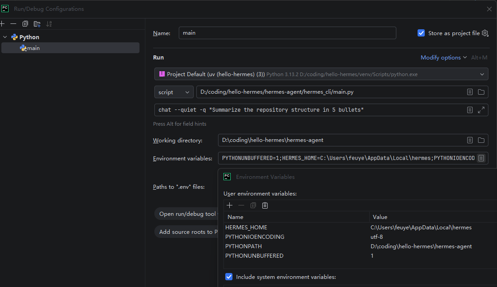

# Hello Hermes Agent ☤

这是一个用于分析 [Hermes Agent](https://github.com/nousresearch/hermes-agent) `v0.8.0 (v2026.4.8)` `86960cdb` 的工作区。

> ## 正确发音
>
> 注意：本项目中的 “Hermes” 指的是希腊神话中的神。
>
> ✔️ **Hermes**: `/ˈhɜːrmiːz/` — 希腊神话中的语言、文字之神，众神的使者（赫尔墨斯）。
>
> ✖️ **Hermès**: `/ɛʁ.mɛs/` — 法国奢侈品牌（爱马仕）。

## 源代码分析

```sh
git clone --depth 1 --branch v2026.4.8 https://github.com/nousresearch/hermes-agent
```

- [Hermes 架构解析 (一)：流程篇 · 源代码执行全生命周期](./Hermes%20架构解析%20(一)：流程篇%20·%20源代码执行全生命周期.md)
- [Hermes 架构解析 (二)：数据篇 · 状态模型与上下文治理](./Hermes%20架构解析%20(二)：数据篇%20·%20状态模型与上下文治理.md)
- [Hermes 架构解析 (三)：扩展篇 · 插件与技能开发全指南](./Hermes%20架构解析%20(三)：扩展篇%20·%20插件与技能开发全指南.md)
- [Hermes 架构解析 (四)：调试篇 · 完整链路走查](./Hermes%20架构解析%20(四)：调试篇%20·%20完整链路走查.md)

## 快速开始

```bash
# Linux / macOS / WSL2 / Android (Termux)
curl -fsSL https://raw.githubusercontent.com/NousResearch/hermes-agent/main/scripts/install.sh | bash
# Windows
powershell -Command "Set-ExecutionPolicy Bypass -Scope Process -Force; irm https://raw.githubusercontent.com/NousResearch/hermes-agent/main/scripts/install.ps1 | iex"
```

```bash
# Run the setup wizard
hermes setup

# View/edit configuration
code ~/.hermes/

# Start interactive chat
hermes
```

## PyCharm 断点调试



示例配置在根目录 `.run/`。README 用占位符，XML 保留真实值供对照。

### 1. 配置项目

```bash
cd hermes-agent
rm -rf venv
uv venv venv --python 3.14.3
# macOS: source venv/bin/activate
# Windows: venv\Scripts\activate
uv pip install -e ".[dev,cli,pty,mcp]"
```

### 2. `.run/` 文件说明

| `.run/` 文件 | 对应 `.idea/` 位置 | 作用 |
|---|---|---|
| `main.run.xml` | _(留在 `.run/`)_ | 共享 Run Configuration |
| `workspace.xml` | `workspace.xml` | 本地 RunManager 示例 |
| `misc.xml` | `misc.xml` | 解释器绑定示例 |
| `modules.xml` | `modules.xml` | 模块注册示例 |
| `hello-hermes.iml` | `hello-hermes.iml` | SDK 绑定示例 |

> **易混淆**：`.run/main.run.xml` 对应 `.idea/workspace.xml` 中 `RunManager > configuration name="main"`，不是复制到 `.idea/` 的同名文件。如需复制到 `.idea/`，请用 `.run/workspace.xml`。

### 3. 断点调试

1. 备份 `.idea/`，将 `.run/` 中同名文件复制过去
2. 替换以下占位符为本机值：

```xml
<env name="HERMES_HOME" value="<YOUR_HERMES_HOME>" />
<env name="PYTHONPATH" value="<YOUR_PROJECT_DIR>\hermes-agent" />
<option name="WORKING_DIRECTORY" value="<YOUR_PROJECT_DIR>\hermes-agent" />
<option name="PARAMETERS" value='chat --quiet -q "<YOUR_DEBUG_PROMPT>"' />
<option name="sdkName" value="<YOUR_PYCHARM_SDK_NAME>" />
<orderEntry type="jdk" jdkName="<YOUR_PYCHARM_SDK_NAME>" jdkType="Python SDK" />
```

1. 在 `Run/Debug Configurations` 面板运行 `main`

> PyCharm 若能直接识别 `.run/main.run.xml`，可跳过复制，直接在 IDE 改上述字段。

**关键配置**：

| 项 | 值 |
|---|---|
| 启动入口 | `$PROJECT_DIR$/hermes-agent/hermes_cli/main.py` |
| 工作目录 | `<YOUR_PROJECT_DIR>/hermes-agent` |
| 默认参数 | `chat --quiet -q "<YOUR_DEBUG_PROMPT>"` |
| 环境变量 | `HERMES_HOME`、`PYTHONPATH`、`PYTHONIOENCODING=utf-8`、`PYTHONUNBUFFERED=1` |

**为什么这样设置**：`chat --quiet -q` 走 one-shot 路径，不进交互式 TUI，避免 PyCharm Run 窗口触发 `NoConsoleScreenBufferError`。`HERMES_HOME` 显式指定以复用本机配置和密钥；`PYTHONPATH` / `WORKING_DIRECTORY` 固定到 `hermes-agent/` 贴近命令行实际环境。

调试其他请求只需改 `PARAMETERS`：

```bash
chat --quiet -q "Read the current repo and explain the startup flow"
chat --quiet -q "Return only JSON: {status, summary}"
chat --quiet --toolsets web,terminal -q "Check the latest Python release and write notes to notes/python.md"
```

> **入口点**：`hermes_cli/main.py:main()` 是统一 CLI 入口（one-shot）。也可调试 `run_agent.py:main()`（agent kernel）或 `acp_adapter/entry.py:main()`（ACP 适配器）。对应关系见 [pyproject.toml](https://github.com/nousresearch/hermes-agent/blob/main/pyproject.toml) L99–102 `[project.scripts]`。

进一步查看这条 one-shot 请求的完整调用链、启动链、工具分支与状态持久化路径，可直接参考：

- [Hermes 架构解析 (四)：调试篇 · 完整链路走查](./Hermes%20架构解析%20(四)：调试篇%20·%20完整链路走查.md)

## 多轮会话调试

运行完整的多轮对话时，用 `--resume` / `-r` 参数恢复以前的 session，保持完整的上下文：

```bash
# 第 1 轮：初始请求（返回 session_id）
python hermes-agent/hermes_cli/main.py chat --quiet -q "Summarize the repository structure in 5 bullets"
# Output: session_id: 20260413_194556_5aebb2

# 第 2 轮：恢复 session，继续提问
python hermes-agent/hermes_cli/main.py chat --quiet --resume 20260413_194556_5aebb2 -q "Based on your summary, what are the main entry points?"

# 第 3 轮：再次恢复同一 session
python hermes-agent/hermes_cli/main.py chat --quiet -r 20260413_194556_5aebb2 -q "How would I add a new tool to the system?"
```

**Session 管理**：

| 命令 | 效果 |
|---|---|
| `-r <SESSION_ID>` / `--resume <SESSION_ID>` | 恢复特定 session |
| `-c` / `--continue` | 恢复最近一次的 CLI session |
| `-c "会话名称"` | 按名称恢复（需先用 `hermes sessions rename` 命名） |
| `hermes sessions list` | 查看所有 session |
| `hermes sessions export output.jsonl --session-id <ID>` | 导出特定 session |

---

## 相关资源

- **官方仓库**: <https://github.com/nousresearch/hermes-agent>
- **官方网站**: <https://hermes-agent.nousresearch.com>
- **快速入门文档**: <https://hermes-agent.nousresearch.com/docs/getting-started/quickstart>


